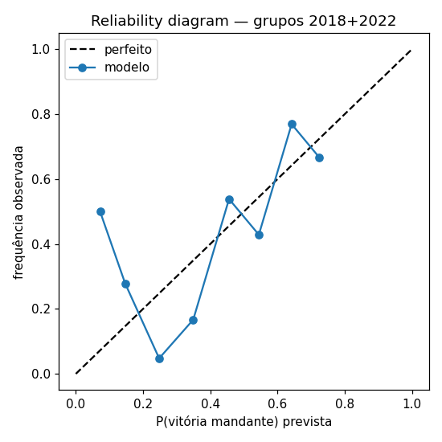

# Backtest — Copas 2018 e 2022

Modelo treinado só com dados anteriores a cada Copa (sem vazamento).

## Copa 2018  (melhor w = 0.8)

- Jogos de grupo avaliados: 48
- **Modelo**: log-loss = 0.9291 | Brier = 0.5494
- Baseline (climatologia): log-loss = 1.0326 | Brier = 0.6241
- Ganho sobre baseline (log-loss): 10.0%
- Campeão real **France**: P(título) = 6.4% (5º favorito previsto)
- Top 5 previstos: Brazil 28.1%, Spain 17.5%, Argentina 8.9%, Germany 8.3%, France 6.4%

## Copa 2022  (melhor w = 1.0)

- Jogos de grupo avaliados: 48
- **Modelo**: log-loss = 1.0725 | Brier = 0.6265
- Baseline (climatologia): log-loss = 1.0594 | Brier = 0.6424
- Ganho sobre baseline (log-loss): -1.2%
- Campeão real **Argentina**: P(título) = 11.5% (3º favorito previsto)
- Top 5 previstos: Brazil 17.2%, Spain 12.5%, Argentina 11.5%, Portugal 10.2%, England 8.7%

## Varredura do peso do ensemble (log-loss combinado)

- w = 0.0: 2.1234
- w = 0.25: 2.0918
- w = 0.5: 2.0576
- w = 0.65: 2.0228
- w = 0.8: 2.0079
- w = 1.0: 2.0043   <- melhor

**Recomendação: ENSEMBLE_W = 1.0** (atual no config: 0.65)

